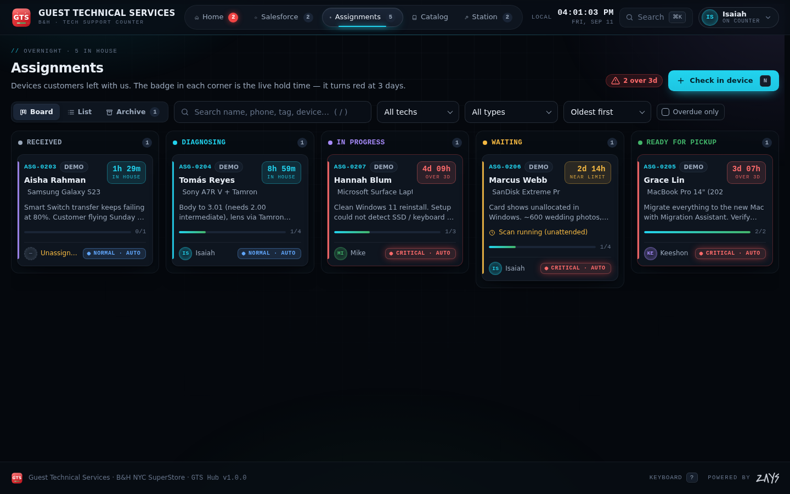
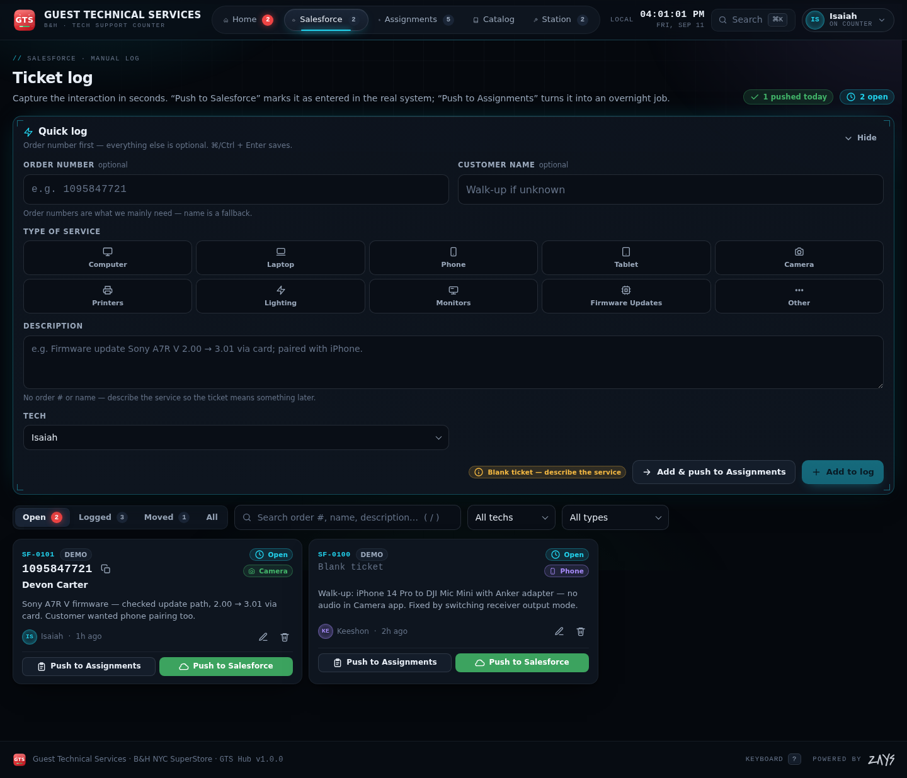
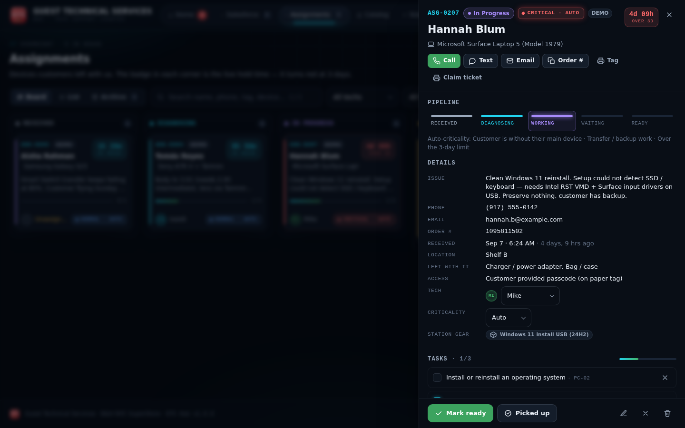

# GTS Hub — Guest Technical Services

Work tracking for the B&H GTS counter. Three techs (Mike, Keeshon, Isaiah), one board.

| Home | Assignments |
|---|---|
|  |  |

| Salesforce log | Assignment detail |
|---|---|
|  |  |

Built with Next.js (App Router) + React, no UI libraries, no AI connections. Deploys to Vercel as-is.

---

## Run it

```bash
npm install
npm run dev        # http://localhost:3000
```

## Deploy to Vercel

1. Push this folder to a GitHub repo.
2. In Vercel: **Add New → Project → Import** the repo. Framework is auto-detected (Next.js). No env vars needed.
3. Deploy. Open the URL on the counter PC / iPad / phones and pick your tech in **Home → Settings**.

Or from the folder: `npx vercel` (then `npx vercel --prod`).

---

## What’s inside

### Home
* **Needs attention** — every device over the limit (default **3 days**, configurable), devices ready but not collected, waiting jobs with no update, unassigned jobs, tickets that haven’t been pushed to Salesforce, and gear checked out to closed jobs. Critical items glow red; the Home tab badge shows the critical count.
* KPIs (open tickets, in house, overdue, ready, closed today), **Who has what** per-tech load, pipeline donut, 14-day intake sparkline, service mix, and a daily shift checklist.
* **Activity** — audit feed of everything anyone did, with who and when.
* **Settings** — pick your tech (auto-fills every ticket you create), overdue threshold, station name, counter phone (printed on claim tickets), dark/light theme, optional UI sounds, backups (JSON/CSV), restore, demo data, team sync.

### Salesforce
* **Quick log** at the top: order number first (the thing that matters), name optional, service type dropdown/grid (Computer, Laptop, Phone, Tablet, Camera, Printers, Lighting, Monitors, Firmware Updates, Other), description, tech. `⌘/Ctrl + Enter` saves.
* **Blank tickets** are allowed when there’s no order number or name — but then a service type or a description is required so the entry means something later.
* **Push to Salesforce** = marks the ticket as entered in the real system (there is no Salesforce API — by design). Undo from the toast or reopen later.
* **Push to Assignments** = opens the overnight intake pre-filled from the ticket and links the two records.

### Assignments (overnight drop-offs)
* **Intake** requires name + phone (email optional). Also: order #, device make/model, requested work, accessories left with the device, storage location, “customer provided passcode” flag (never store the passcode itself), promised-by date, tech, and catalog task suggestions.
* **Hold-time badge** in every card corner, ticking live: `1h 29m` → `2d 14h` (amber near the limit) → `4d 09h` in **red** past the limit, pulsing after limit + 2 days.
* **Auto-criticality**: Low / Normal / High / Critical computed from device age, promised date, deadline words (“wedding”, “flight”…), data-loss symptoms (“recovery”, “won’t boot”…), and whether the customer is without their main device. Escalates on its own as the days pass; can be overridden manually.
* **Board** (drag cards between Received → Diagnosing → In Progress → Waiting → Ready for Pickup), **List**, and **Archive** views; search, tech/type filters, sort, overdue-only.
* **Detail drawer**: pipeline stepper (waiting reasons), call / text / email / copy-order buttons, editable tech + criticality, task checklist with catalog suggestions, work log with quick templates, **print intake tag** (for the device) and **claim ticket** (for the customer), mark ready, picked up, cancel, reopen, delete with undo.

### Catalog
The 17-area / 124-type GTS service catalog from the brief, searchable, with scope + “done when” evidence and the Core / Discussed / Proposed labels. Any entry can be attached to an active job as a checklist task. The improvement backlog (PROJ-01…08) is listed at the bottom.

### Station
* **Inventory**: readers, cables, working storage, loaners, consumables. Serialized assets, counted pools, or consumables with low-stock alerts. Check out to a tech (optionally for a job), check in as working or **quarantine** damaged gear, adjust stock.
* **Shift handoff**: a live text sheet — alerts, in-house devices per tech with last note, un-pushed tickets, gear out. Copy to the group chat or print.

### Everywhere
* `⌘K` command palette: jump to any ticket/assignment/inventory item or run an action.
* Shortcuts: `N` new assignment · `T` new ticket · `/` search · `1–5` tabs · `?` help · `Esc` close.
* Undo toasts, live clock, mobile bottom nav, installable (Add to Home Screen), prints via hidden iframe (no popups).

---

## Data & storage

* Everything is stored **in the browser** (`localStorage`) on each device. It survives reloads and deploys. Clearing site data clears the records — export a backup from Settings once in a while (JSON restores anywhere; CSV is for spreadsheets).
* **Demo data** is clearly labeled (`DEMO` chips) and removable with one click in Settings → Data.
* Deleting is soft (undo available); records keep `updatedAt` stamps and an activity trail.

## Optional: team sync (one board for all three of you)

Local mode is fine when everyone uses the same station PC. To share the board across the PC, iPad and phones:

1. Vercel project → **Storage** → **Create Database** → **Upstash Redis** (free tier is plenty). Vercel injects `KV_REST_API_URL` and `KV_REST_API_TOKEN` automatically. (Manual alternative: create a database at upstash.com and set `UPSTASH_REDIS_REST_URL` + `UPSTASH_REDIS_REST_TOKEN` in Vercel → Settings → Environment Variables.)
2. Add `GTS_SYNC_KEY` = a passcode the team shares (**do this** — without it anyone with the URL could read/write the board).
3. Redeploy. On each device: Settings → Team sync → enter the passcode. The footer/top-bar dot turns green (`SYNC`).

How it works: `app/api/sync/route.js` stores one JSON document in Redis with a revision counter. Devices pull on load/focus/every 45 s and push ~2 s after a change. Writes are compare-and-set; on a conflict the app merges record-by-record (newest `updatedAt` wins, deletions are tombstoned) and retries, so two stations can’t clobber each other. Settings (your tech, theme) never sync.

> Privacy note: with sync on, customer names and phone numbers live in the Redis database as well as on the devices. Check that’s OK with management before enabling; local mode keeps everything on the station device.

## Customizing

| What | Where |
|---|---|
| Techs (names, colors) | `lib/constants.js` → `TECHS` |
| Service types, statuses, wait reasons, accessories, storage spots, note templates | `lib/constants.js` |
| Overdue threshold default, station/store labels | `lib/constants.js` → `DEFAULT_SETTINGS` (or Settings in the app) |
| Criticality rules | `lib/utils.js` → `computePriority` |
| Alerts | `lib/utils.js` → `buildAlerts` |
| Catalog | edit `docs/GTS_Assignment_Catalog.json`, then `python3 scripts/build-catalog.py` regenerates `lib/catalog.js` |
| Colors, fonts, motion | `app/globals.css` → `:root` tokens |
| Logos | `components/ui.jsx` → `GTSMark`, `ZaysLogo`; static copies in `public/` and `app/icon.svg` |
| Print layouts | `lib/print.js` |

## Project structure

```
app/
  layout.jsx           fonts, metadata, theme boot script
  page.jsx             renders <GTSApp/>
  globals.css          design system (tokens · shell · components · responsive)
  icon.svg             favicon (original GTS mark)
  manifest.js          PWA manifest
  api/sync/route.js    optional Upstash-backed team sync
components/
  GTSApp.jsx           store, persistence, sync loop, shell, overlays, shortcuts
  HomeTab.jsx          overview · activity · settings
  SalesforceTab.jsx    quick log + ticket list
  AssignmentsTab.jsx   board / list / archive
  CatalogTab.jsx       service catalog browser
  StationTab.jsx       inventory + shift handoff
  assignment-views.jsx intake form, ticket form, detail drawer
  ui.jsx               icons, logos, buttons, panels, forms, charts
lib/
  constants.js · utils.js · store.js · sync.js · print.js · sounds.js · catalog.js · zays-logo.js
```

## Known limits

* No login. It’s an internal tool — keep the URL private; the sync passcode only protects the shared database.
* Fonts (Inter, Space Grotesk, JetBrains Mono) load from Google Fonts; on a network that blocks them the app falls back to system fonts.
* “Push to Salesforce” is a status flag, not an integration.
* Local mode is per-browser; team sync needs the 5-minute Upstash setup above.
* Printing uses the browser’s print dialog (works on the station PC and iPad/AirPrint).
