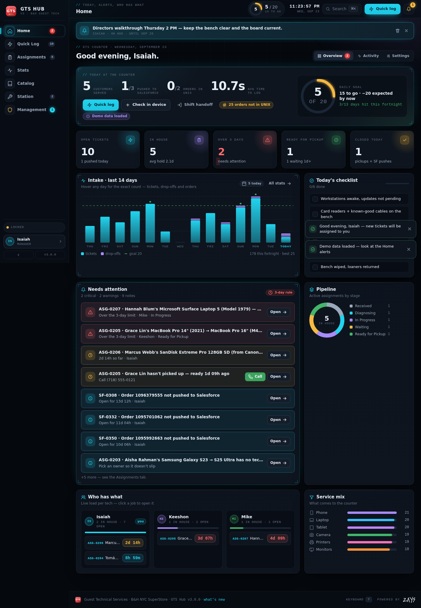
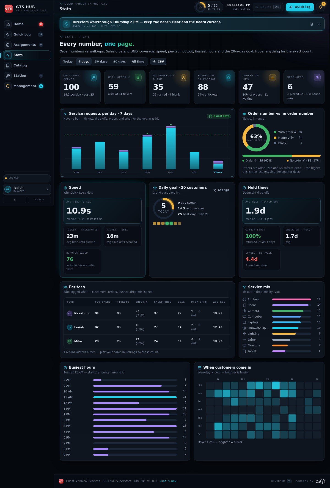
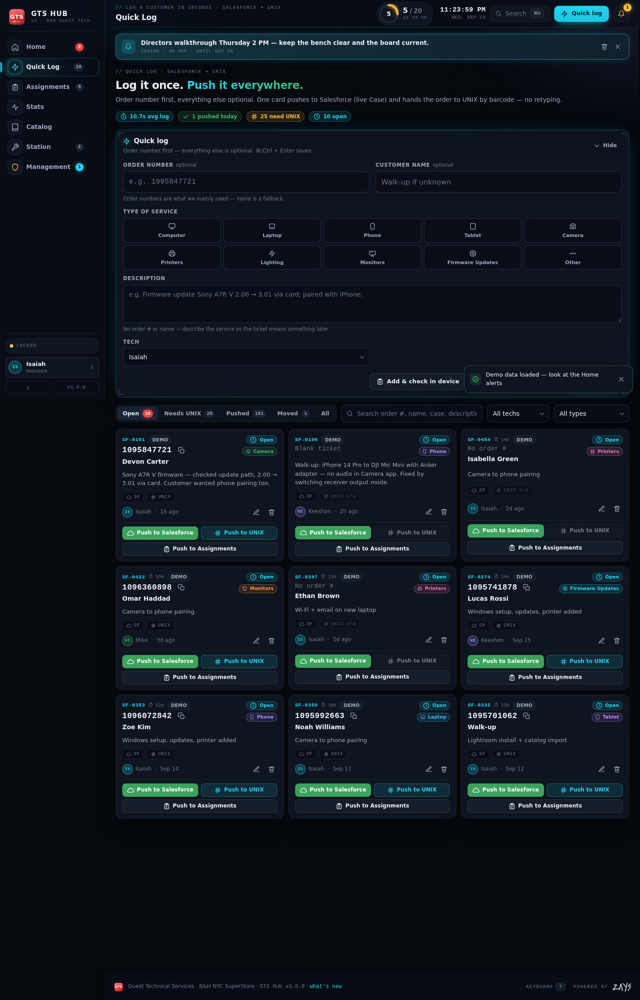
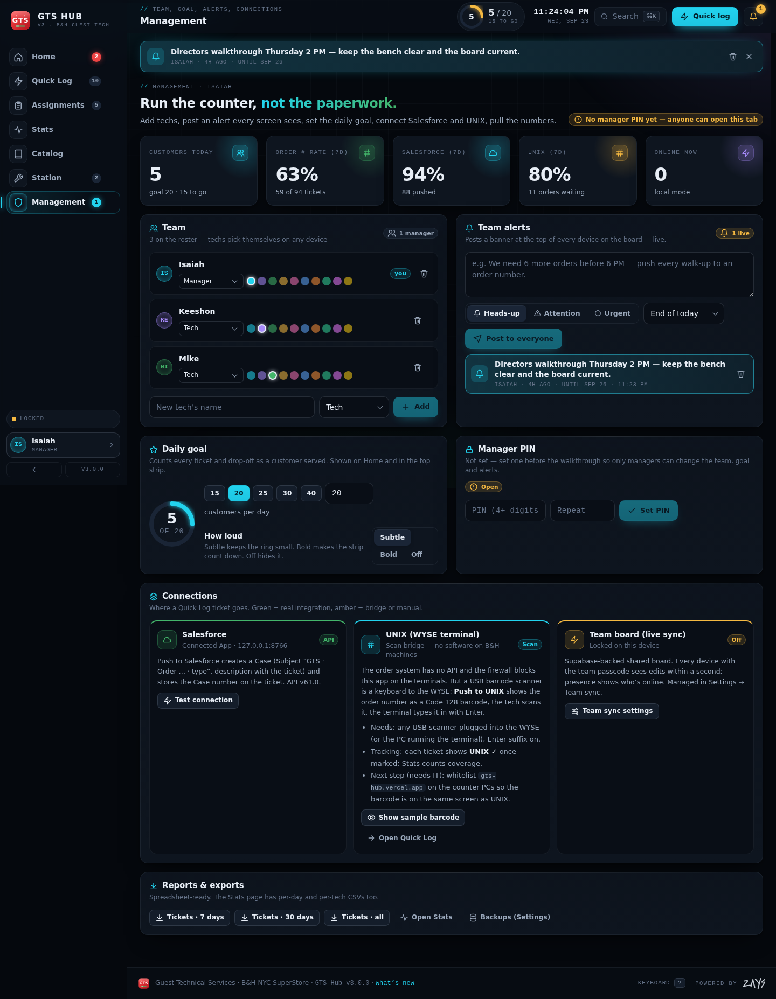

# GTS Hub V3 — Guest Technical Services

The B&H GTS counter, on one live board. **Log a customer once, push it everywhere**: Salesforce, UNIX, the overnight board — with every number the directors could ask for on one Stats page.

| Home | Stats |
|---|---|
|  |  |

| Quick Log | Management |
|---|---|
|  |  |

Built with Next.js (App Router) + React, a hand-rolled design system (no UI libraries), Supabase for the live team board, and an optional Salesforce Connected App. Deploys to Vercel as-is. Live at **https://gts-hub.vercel.app**.

---

## What’s new in V3

* **Quick Log** (was “Salesforce”) — the order number is the only thing that matters, so it is the first field. A **stopwatch** starts at your first keystroke and the ticket remembers how long it took (`⏱ 6.2s` on the card). Three ways to finish: *Add to log*, *Add & check in device*, *Add & push to UNIX*. Every ticket card shows a **SF / UNIX** status pair so you can see at a glance what still needs to go where.
* **Stats tab** — every number on one page: customers served vs the daily goal, **order number vs no order number**, Salesforce and UNIX coverage, speed (avg time to log, ticket → Salesforce, ticket → UNIX, minutes saved vs double entry), hold times, per-tech table, service mix, busiest hours, a weekday × hour heatmap, and CSV exports. Ranges: today / 7 / 30 / 90 days / all time.
* **Intake chart** on Home (and Stats) is **hoverable** — every bar is a day, hover shows exactly how many service requests came in (tickets, drop-offs, with order #, goal hit or short by how many). Tickets that later became a drop-off are counted once.
* **Daily goal** — default **20 customers a day**, shown as a ring in the top strip and on Home (“15 to go · ~12 expected by now”), with streaks and hit/miss days in Stats. Managers change it with one click (15 / 20 / 25 / 30 / 40 or any number) and choose how loud it is (subtle / bold / off).
* **Management tab** — team roster (add, rename, recolor, remove and restore techs — every device updates live), **team alerts** (a banner at the top of every screen, three tones, optional expiry), the daily goal, a **manager PIN** (SHA-256, shared across devices; until one is set the tab is open), **connections** (Salesforce, UNIX, team board) and one-click exports.
* **Salesforce integration** — with a Connected App configured (three env vars), *Push to Salesforce* creates a real **Case** and stores the Case number + link on the ticket. Without it, the button still works as the “I entered it” flag it always was.
* **UNIX scan bridge** — *Push to UNIX* shows the order number as a **Code 128 barcode**. A USB barcode scanner plugged into the WYSE terminal types it into UNIX with Enter — no software on B&H machines, nothing for the firewall to block. Details below.
* **New shell** — sidebar rail with badges and keyboard hints (collapsible with `[`), command strip with the goal ring, who’s online, live clock, search and a Quick log button that is never more than one click away. Same colors, same neon framing, a lot more room.
* Keyboard: `1–7` tabs · `T` ticket · `N` drop-off · `/` search · `⌘K` palette · `[` collapse rail · `?` all shortcuts.

---

## Run it

```bash
npm install
npm run dev        # http://localhost:3000
```

## Deploy to Vercel

1. Push this folder to a GitHub repo.
2. In Vercel: **Add New → Project → Import** the repo. Framework is auto-detected (Next.js). No env vars are needed for local mode.
3. Deploy. Open the URL on the counter PC / iPad / phones and pick your tech (the app asks on first launch; change it any time by clicking your name in the rail).
4. For the shared live board attach Supabase (*Team sync* below). For real Salesforce Cases add the three `SF_*` variables (*Connections* below).

Or from the folder: `npx vercel` (then `npx vercel --prod`).

---

## What’s inside

### Home
* **Today at the counter** hero: customers served, pushed to Salesforce, orders in UNIX, avg time to log — plus the goal ring and pace.
* **Needs attention** — every device over the limit (default **3 days**, configurable), devices ready but not collected, waiting jobs with no update, unassigned jobs, tickets not pushed to Salesforce, orders not in UNIX, gear checked out to closed jobs. Critical items glow red; the Home badge shows the critical count.
* KPIs, the hoverable **Intake · last 14 days** chart, the shift checklist, pipeline donut, **Who has what** per tech, service mix.
* **Activity** — audit feed of everything anyone did (tickets, drop-offs, team changes, alerts, goal changes), with who and when.
* **Settings** — overdue threshold, station name, counter phone (printed on claim tickets), theme, sounds, backups (JSON/CSV), restore, demo data, and **Team sync**.

### Quick Log
* Order number first, name optional, service type, description, tech. `⌘/Ctrl + Enter` saves. The stopwatch runs from the first keystroke.
* Blank tickets (no order number, no name) are allowed but need a service type or description so the entry means something later.
* Views: Open · Needs UNIX · Pushed · Converted · All. Search matches order numbers, names, tags and Case numbers.
* **Push to Salesforce** creates a Case when the connector is configured (Case number and “Open Case” link on the card), otherwise flags the ticket. **Push to UNIX** opens the barcode. **Push to Assignments** opens the overnight intake pre-filled and links both records.

### Assignments (overnight drop-offs)
* Intake requires name + phone (email optional). Also: order #, device make/model, requested work, accessories left, storage spot, “customer provided passcode” flag (never the passcode itself), promised-by date, tech, catalog task suggestions.
* Hold-time badge ticking live in every card corner (`1h 29m` → `2d 14h` amber → `4d 09h` red past the limit).
* Auto-criticality from device age, promised date, deadline words, data-loss language and whether the customer is without their main device; manual override.
* Board (drag between stages), List and Archive views; detail drawer with stepper, call / text / email, task checklist, work log, print intake tag + claim ticket, ready / picked up / cancel / reopen / delete with undo.

### Stats
See *What’s new*. All numbers come from one pure function (`lib/stats.js`) so Home, Stats and Management always agree.

### Catalog
The 17-area / 124-type GTS service catalog, searchable, with scope + “done when” evidence and Core / Discussed / Proposed labels. Any entry can be attached to an active job as a checklist task.

### Station
Inventory (serialized assets, counted pools, consumables with low-stock alerts; check out / check in / quarantine) and the shift handoff sheet.

### Management
Team · Alerts · Daily goal · Manager PIN · Connections · Exports. Managers see it in the rail; once a PIN is set, techs get a lock screen. The PIN unlock is remembered per device (lock it again from the tab).

---

## Connections

### Team sync — one live board for all of you (Supabase)

Without a database the app runs in **local mode** (each browser keeps its own records). Attach the free Supabase database and every edit shows up on the other screens within about a second, with a “who’s online” indicator in the strip.

1. Vercel → project → **Storage** → **Create Database** → **Supabase**. Vercel injects `SUPABASE_URL`, `SUPABASE_ANON_KEY`, `SUPABASE_SERVICE_ROLE_KEY` and `POSTGRES_URL` automatically. Redeploy.
2. First device: **Settings → Team sync → Create the team passcode**. The table is created automatically on first contact.
3. Everyone else: Settings → Team sync → type the passcode → *Connect*. The rail dot turns green and says **LIVE**.

How it works: one JSON document with a revision counter in the `gts_sync` table; writes are compare-and-set; conflicts merge record by record (newest `updatedAt` wins, deletions are tombstoned, merges are canonical so devices converge); every write fires a Supabase Realtime broadcast so open devices pull immediately; presence on the same channel powers the online avatars. The team roster, alerts and management settings (goal, PIN hash) are part of the shared document. Your tech, theme, sounds and passcode never leave the device.

### Salesforce — real Cases from Quick Log

Ask the B&H Salesforce admin for a **Connected App** with the **OAuth 2.0 Client Credentials Flow** enabled and a run-as user (integration user) that can create Cases. Then in Vercel → Settings → Environment Variables:

| Variable | Value |
|---|---|
| `SF_INSTANCE_URL` | the org URL, e.g. `https://bhphoto.my.salesforce.com` |
| `SF_CLIENT_ID` | the Connected App consumer key |
| `SF_CLIENT_SECRET` | the Connected App consumer secret |
| `SF_CASE_ORIGIN` (optional) | a valid Case *Origin* picklist value (default `Web`) |
| `SF_CASE_RECORD_TYPE_ID` (optional) | Case record type id, if the org uses record types |
| `SF_CASE_FIELDS_JSON` (optional) | extra fields on every Case, e.g. `{"Department__c":"GTS"}` |

Redeploy, then **Management → Connections → Test connection**. From then on *Push to Salesforce* creates a Case (`Subject: GTS · Order 1095847721 · Camera`, description with the ticket details, `SuppliedName` = customer) and stores the Case number and link on the ticket. Secrets stay on the server; the browser only ever talks to `/api/salesforce`, gated by the team passcode.

### UNIX (WYSE terminal) — the scan bridge

The order system has no API, the firewall blocks this app on the B&H machines, and the terminal only understands keystrokes. A **USB barcode scanner is a keyboard**, so:

1. *Push to UNIX* on a ticket shows the order number as a **Code 128 barcode** (big, high-contrast, works on a phone or tablet screen).
2. The tech scans it with a scanner plugged into the WYSE (or the PC running the terminal emulator). The scanner types the digits and presses Enter — the terminal doesn’t know the difference.
3. *Mark as entered in UNIX* — the ticket shows **UNIX ✓**, Stats counts coverage, Home flags orders that still need it.

Needs: any USB HID barcode scanner (≈$25–60, e.g. a Tera / NADAMOO / Inateck 1D scanner) with the **Enter suffix** on (usually the default). The modal has a self-test: scan into it and it confirms the scanner is typing the digits + Enter.

Next steps that need IT: whitelist `gts-hub.vercel.app` on the counter PCs so the barcode is on the same screen as the terminal, and — if the terminal is a Windows emulator (PuTTY, TinyTERM, ZOC…) — an AutoHotkey/macro bridge can type the number straight in without a scanner. A real integration (import job or SSH on the UNIX host) is the B&H UNIX admin’s call; the app already records everything it would need (order number, ticket, tech, time).

---

## Data & storage

* Everything is cached **in the browser** (`localStorage`) on each device and, with team sync on, mirrored in the shared Supabase document. Export a backup from Settings once in a while.
* **Demo data** is clearly labeled and removable with one click in Settings → Data.
* Deleting is soft (undo available); records keep `updatedAt` stamps and an activity trail.

> Privacy note: with sync on, customer names and phone numbers live in the Supabase database as well as on the devices. Row Level Security is on and the browser only ever holds the public anon key — data is read/written through the API route with the server-side key, gated by the team passcode. Keep the URL private anyway.

## Customizing

| What | Where |
|---|---|
| Techs (names, roles, colors) | **Management → Team** in the app (seed list in `lib/constants.js` → `DEFAULT_TEAM`) |
| Daily goal, alerts, manager PIN | **Management** in the app |
| Service types, statuses, wait reasons, accessories, storage spots, note templates | `lib/constants.js` |
| Overdue threshold default, station/store labels | `lib/constants.js` → `DEFAULT_SETTINGS` (or Settings in the app) |
| Criticality rules / alerts | `lib/utils.js` → `computePriority`, `buildAlerts` |
| Stats definitions | `lib/stats.js` |
| Salesforce Case mapping | `lib/salesforce-server.js` → `caseFromTicket` |
| Catalog | edit `docs/GTS_Assignment_Catalog.json`, then `python3 scripts/build-catalog.py` |
| Colors, fonts, motion | `app/globals.css` → `:root` tokens |
| Logos | `components/ui.jsx` → `GTSMark`, `ZaysLogo`; static copies in `public/` and `app/icon.svg` |
| Print layouts | `lib/print.js` |

## Project structure

```
app/
  layout.jsx · page.jsx · globals.css · icon.svg · manifest.js
  api/sync/route.js         team sync API (Supabase: CAS document + realtime ping + passcode)
  api/salesforce/route.js   Salesforce status / test / create Case (passcode-gated)
components/
  GTSApp.jsx           store, persistence, sync loop + live channel, shell (rail, strip, alerts), overlays, shortcuts
  HomeTab.jsx          overview · activity · settings
  SalesforceTab.jsx    Quick Log + ticket list
  AssignmentsTab.jsx   board / list / archive
  StatsTab.jsx         every number on one page
  ManagementTab.jsx    team · alerts · goal · PIN · connections · exports
  UnixScan.jsx         Code 128 barcode modal + scanner self-test
  CatalogTab.jsx · StationTab.jsx · assignment-views.jsx
  ui.jsx               icons, logos, buttons, panels, forms, charts (HoverChart, Heatmap, Ring, SplitBar)
lib/
  constants.js · utils.js · store.js (merge) · stats.js · barcode.js · pin.js
  sync.js (client) · sync-server.js (server) · realtime.js
  salesforce.js (client) · salesforce-server.js (server)
  print.js · sounds.js · catalog.js · zays-logo.js
```

## Known limits

* No login. It’s an internal tool — keep the URL private; the team passcode protects the shared database and the manager PIN protects Management.
* Fonts load from Google Fonts; on a network that blocks them the app falls back to system fonts.
* UNIX is a scan bridge, not an integration, until B&H IT opens a door (see *Connections*).
* Local mode is per-browser; the live board needs the Supabase setup.
* Display tags (SF-0001 / ASG-0001) are assigned on the device; two devices creating a record in the same second can end up with the same tag (ids stay unique).
* Printing uses the browser’s print dialog.
